# Terraform Security Lab

A reproducible experimental framework for evaluating Terraform Infrastructure-as-Code (IaC) security scanning using KICS, Trivy, Checkov, and a combined multi-scanner detection approach.

## 1. Project Overview

This repository supports a research-oriented comparison of static IaC security scanners on Terraform workloads. The project evaluates how scanner rule coverage, detection patterns, and multi-tool aggregation affect the identification of unsafe Terraform configurations in both controlled test cases and real-world repositories.

The lab is designed to be fully reproducible and includes:

- Controlled synthetic and secure Terraform corpora
- Independent real-world Terraform repositories
- Scanner result capture for KICS, Trivy, and Checkov
- Ground-truth evaluation for controlled benchmarks
- Raw result aggregation and metric generation
- Graphs for performance and complementarity analysis

---

## 2. Research Objectives

The project evaluates whether combining multiple IaC security scanners improves vulnerability detection compared with relying on a single scanner.

The experiment measures:

- True positives (TP)
- True negatives (TN)
- False positives (FP)
- False negatives (FN)
- Accuracy
- Precision
- Recall
- F1-score
- False-positive rate (FPR)
- Scanner complementarity
- Raw finding volume and severity distribution

The overall research question is straightforward:

> Can a multi-scanner strategy expand detection coverage beyond the rule set of any single static scanner while remaining practically reproducible in real Terraform repositories?

Three corpora are evaluated:

1. Synthetic vulnerable Terraform cases: S01-S10
2. Secure baseline cases: B01-B10
3. Independent real-world Terraform repositories from the IaCSecBench benchmark

---

## 3. Security Scanners

### KICS

KICS scans Infrastructure-as-Code configurations for security issues and is used as one of the primary multi-tool detection sources.

Raw results are stored under:

```text
results/kics/
results/independent/kics/
```

### Trivy

Trivy is used for Terraform misconfiguration scanning and produces JSON results for policy and misconfiguration analysis.

Raw results are stored under:

```text
results/trivy/
results/independent/trivy/
```

### Checkov

Checkov provides policy-based IaC security analysis and is used to assess scanner agreement and independent coverage.

Raw results are stored under:

```text
results/checkov/
results/independent/checkov/
```

These scanner outputs are combined in the analysis pipeline to explore overlap, complementarity, and detection coverage.

---

## 4. Dataset

### Controlled Dataset

The controlled corpus contains intentionally vulnerable and secure Terraform cases, enabling a binary classification evaluation against known ground truth.

#### Synthetic vulnerable cases

Ten intentionally vulnerable Terraform configurations represent common IaC security weaknesses.

| Case | Target vulnerability |
|---|---|
| S01 | Public S3 access |
| S02 | Unrestricted SSH security group |
| S03 | Excessive IAM privileges |
| S04 | Unsecured RDS |
| S05 | Unencrypted S3 |
| S06 | Public S3 write access |
| S07 | Unrestricted RDP security group |
| S08 | Dangerous IAM PassRole |
| S09 | Excessive Lambda IAM privileges |
| S10 | Public/unprotected RDS |

#### Secure baseline cases

Ten secure configurations, B01-B10, are used to evaluate false-positive behavior.

#### Public validation corpus

Five public Terraform projects, P01-P05, are included as an external validation set. They are analyzed separately from the controlled benchmark because their source metadata does not follow the same one-target-per-case ground-truth structure.

### Independent Real-World Dataset

The real-world benchmark consists of 25 Terraform repositories from the IaCSecBench independent corpus.

| Metric | Result |
|---|---:|
| Repositories | 25 |
| Terraform files | 285 |
| Terraform LOC | 15,226 |
| Terraform resources | 728 |
| Terraform modules | 41 |
| KICS findings | 1,094 |
| Trivy findings | 185 |
| Checkov findings | 286 |
| Combined raw findings | 1,565 |
| Mean findings / 1,000 LOC | 111.495 |
| Median findings / 1,000 LOC | 80.838 |
| Mean findings / resource | 2.626 |
| Median findings / resource | 2.320 |

#### Scanner coverage

| Scanner | Findings | Share | Repositories |
|---|---:|---:|---:|
| KICS | 1,094 | 69.90% | 25 |
| Checkov | 286 | 18.27% | 20 |
| Trivy | 185 | 11.82% | 13 |

The generated analysis summaries are under:

```text
experiment/generated/independent/
```

Currently, the independent dataset provides CSV summaries rather than generated PNG plots. No additional independent graph files were created for the README beyond the existing controlled experiment graphs listed below.

---

## 5. Experimental Methodology

Each synthetic and baseline case is independently scanned by all three tools.

The resulting case-level detection matrix uses:

```text
1 = target vulnerability detected
0 = target vulnerability not detected
```

The controlled ground truth identifies whether the target vulnerability is intentionally present.

The combined framework uses the union of scanner detections:

```text
Combined = KICS OR Trivy OR Checkov
```

This evaluates whether complementary scanners increase detection coverage.

For the independent real-world corpus, the analysis is based on repository-level raw findings and aggregate volume rather than case-by-case ground-truth labeling. The purpose is to characterize scanner output breadth and overlap in realistic Terraform repositories.

The repository also includes a custom cross-resource IAM validation component:

```text
results/custom-iam.txt
```

This demonstrates how cross-resource relationships such as `iam:PassRole` combined with `ec2:RunInstances` can require analysis beyond single-resource rule checking.

---

## 6. Controlled Benchmark Results

The controlled detection matrix is stored in:

```text
experiment/generated/detection_matrix.csv
```

Final metrics are stored in:

```text
experiment/generated/tool_metrics.csv
experiment/generated/combined_metrics.txt
experiment/generated/final_experiment_summary.txt
```

### Final controlled metrics

| Tool | TP | TN | FP | FN | Accuracy | Precision | Recall | F1 | FPR |
|---|---:|---:|---:|---:|---:|---:|---:|---:|---:|
| KICS | 9 | 10 | 0 | 1 | 94.74% | 100.00% | 90.00% | 94.74% | 0.00% |
| Trivy | 9 | 10 | 0 | 1 | 94.74% | 100.00% | 90.00% | 94.74% | 0.00% |
| Checkov | 10 | 10 | 0 | 0 | 100.00% | 100.00% | 100.00% | 100.00% | 0.00% |
| Combined | 10 | 10 | 0 | 0 | 100.00% | 100.00% | 100.00% | 100.00% | 0.00% |

> The generated result files are the source of truth if the experiment is rerun.

### Generated experiment graphs

The following graphs are existing outputs under `experiment/graphs/` and are included in the repository:

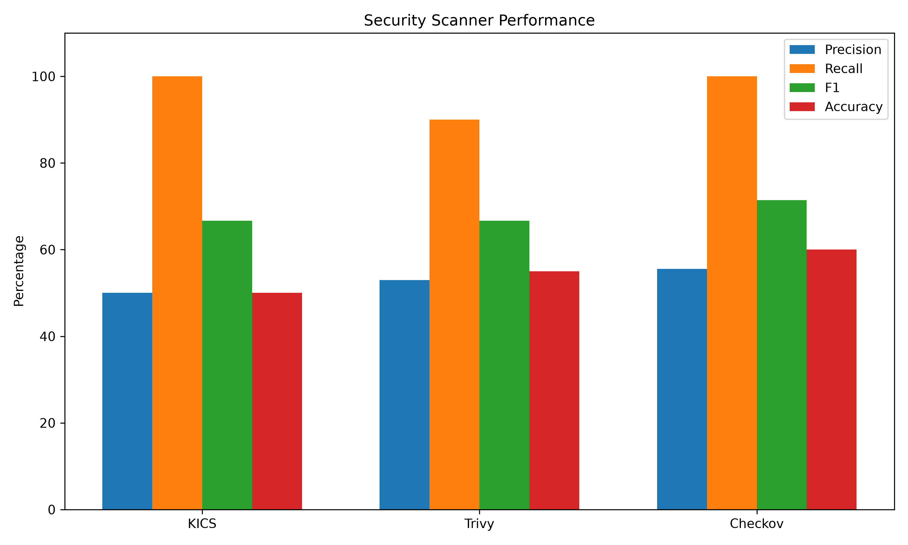

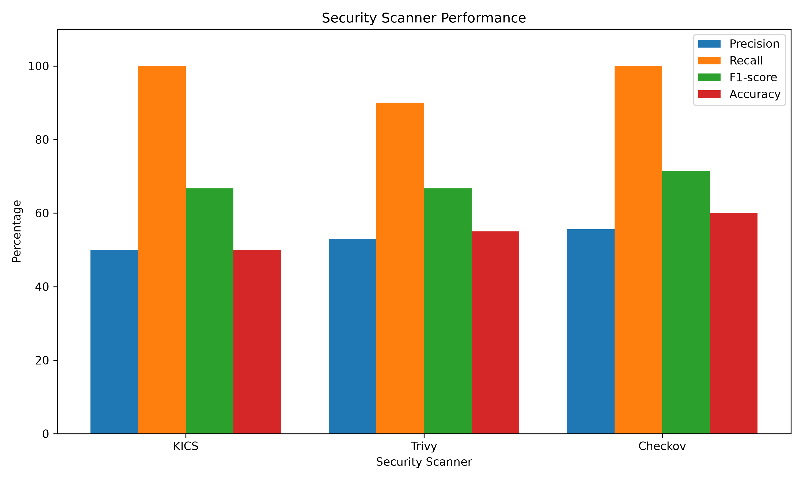

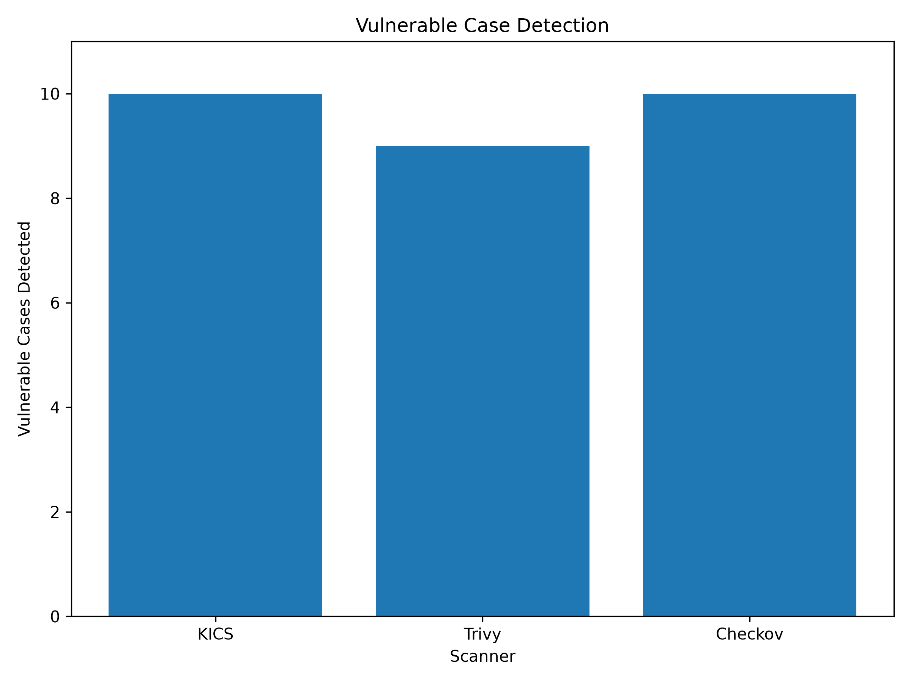

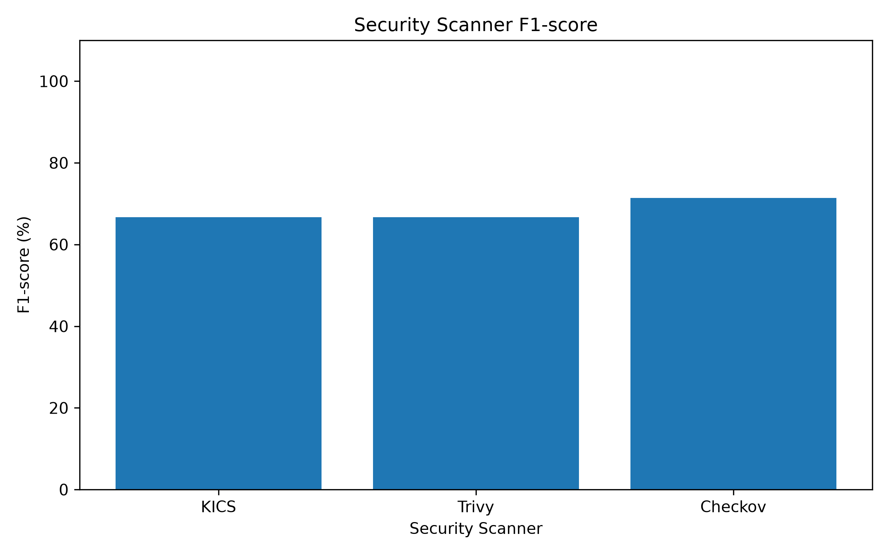

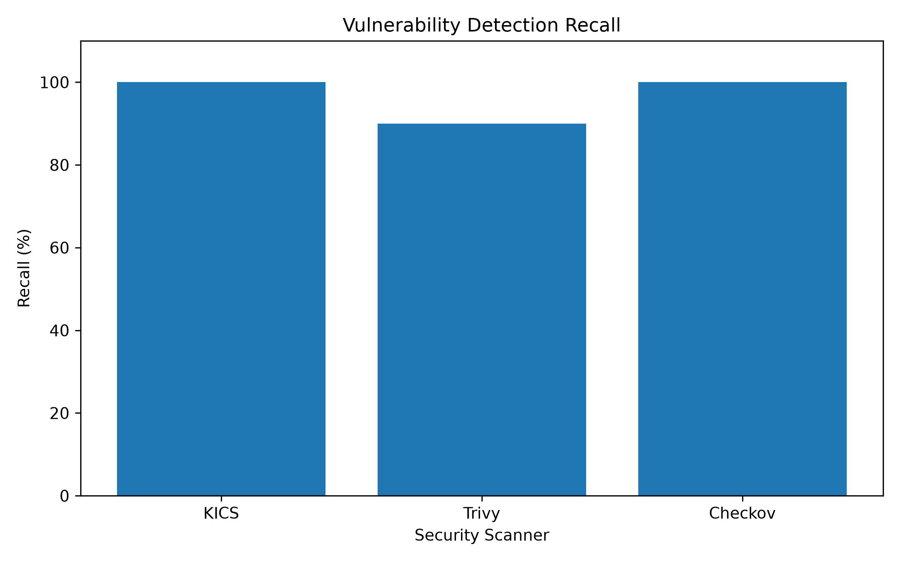


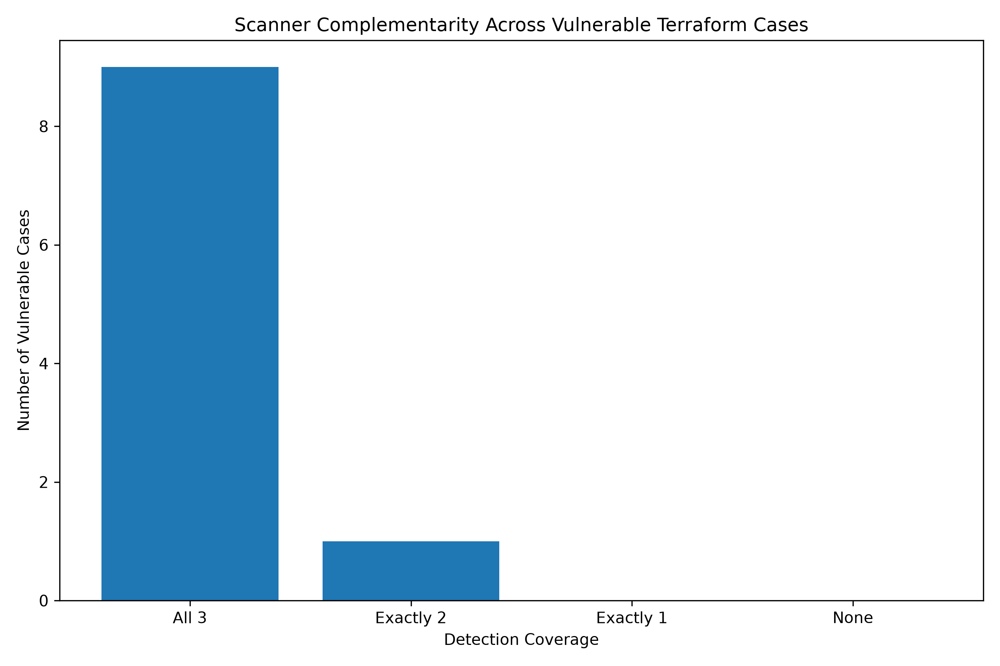

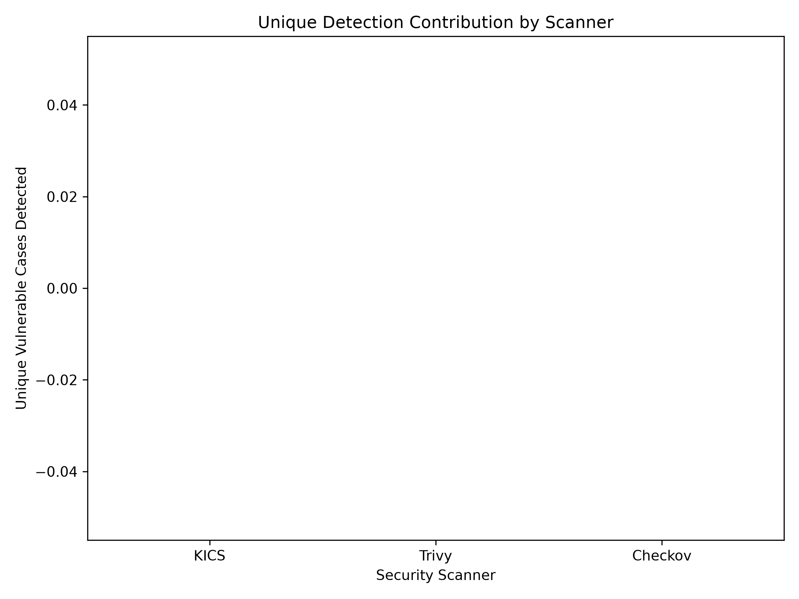

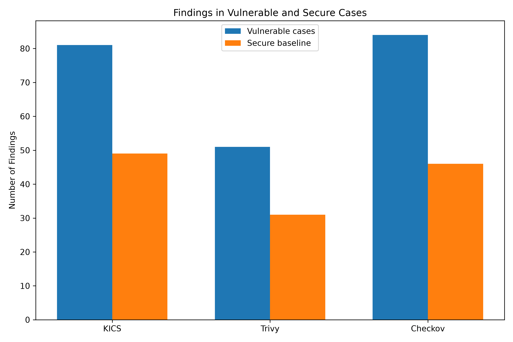

---

## 7. Real-World Dataset Results

The independent real-world dataset is located under:

```text
dataset/independent/iacsecbench/
```

and the corresponding analysis output is generated under:

```text
experiment/generated/independent/
```

### Summary of the independent real-world benchmark

| Metric | Result |
|---|---:|
| Repositories analysed | 25 |
| Terraform files | 285 |
| Terraform LOC | 15,226 |
| Terraform resources | 728 |
| Terraform modules | 41 |
| KICS findings | 1,094 |
| Trivy findings | 185 |
| Checkov findings | 286 |
| Combined raw findings | 1,565 |
| Mean findings / 1,000 LOC | 111.495 |
| Median findings / 1,000 LOC | 80.838 |
| Mean findings / resource | 2.626 |
| Median findings / resource | 2.320 |

### Scanner coverage by repository

| Scanner | Findings | Share | Repositories |
|---|---:|---:|---:|
| KICS | 1,094 | 69.90% | 25 |
| Checkov | 286 | 18.27% | 20 |
| Trivy | 185 | 11.82% | 13 |

### Independent dataset outputs

The current generated summaries include:

```text
experiment/generated/independent/dataset_summary.txt
experiment/generated/independent/scanner_summary.csv
experiment/generated/independent/repository_metrics.csv
experiment/generated/independent/severity_distribution.csv
experiment/generated/independent/finding_categories.csv
```

No independent PNG graphs are currently generated in `experiment/graphs/independent/`; the repository currently provides the CSV-based summary results for this benchmark instead.

---

## 8. Key Findings

The controlled experiment indicates:

1. KICS and Trivy achieved high detection coverage but each missed one controlled target in the final matrix.
2. Checkov detected all ten controlled target vulnerabilities in the final result set.
3. The combined framework detected all ten controlled vulnerabilities.
4. The secure baseline corpus enables explicit evaluation of false positives.
5. The scanners have overlapping but non-identical rule coverage.
6. The independent real-world corpus contains substantially higher raw finding volume than the synthetic benchmark.
7. KICS produced the largest share of raw findings in the independent dataset, followed by Checkov and Trivy.
8. Multi-scanner aggregation is therefore a practical strategy for increasing detection coverage and reducing blind spots.

---

## 9. Project Structure

```text
.
├── dataset/
│   ├── synthetic/                  # Controlled vulnerable Terraform cases
│   ├── secure/                     # Secure baseline cases
│   ├── public/                     # Public Terraform projects
│   ├── independent/
│   │   └── iacsecbench/            # Independent real-world benchmark
│   ├── dataset.csv
│   └── ground_truth.csv
├── experiment/
│   ├── generated/                  # Generated matrices, metrics and summaries
│   ├── graphs/                     # Experiment figures
│   ├── public_dataset/             # Public-dataset analysis
│   ├── results/                    # Experiment result tables
│   ├── scripts/                    # Analysis and plotting scripts
│   └── README.md
├── results/
│   ├── kics/
│   ├── trivy/
│   ├── checkov/
│   ├── public/
│   ├── independent/
│   └── custom-iam.txt
├── scripts/
│   ├── run_kics.sh
│   ├── run_trivy.sh
│   ├── run_checkov.sh
│   ├── run_iacsecbench_scanners.sh
│   └── ...
├── comparison_report.py
├── README.md
└── .gitignore
```

Terraform-generated directories such as `.terraform/` and Terraform state files are intentionally excluded from version control.

---

## 10. Installation

### Prerequisites

- Terraform
- Docker
- Python 3
- KICS
- Trivy
- Checkov

Install or ensure the required tools are available in your PATH before running the scanner workflow.

### Docker-based KICS execution

KICS is executed through Docker, avoiding the need to install the KICS binary directly on the host.

---

## 11. Running the Scanners

Run the individual scanner scripts from the repository root:

```bash
./scripts/run_kics.sh
./scripts/run_trivy.sh
./scripts/run_checkov.sh
```

For the independent benchmark dataset, run:

```bash
./scripts/run_iacsecbench_scanners.sh
```

Scanner outputs are written to `results/` and the independent corpus outputs are stored under `results/independent/iacsecbench/`.

---

## 12. Reproducing the Experiments

After scanning, the analysis pipeline can regenerate the matrices, metrics, and graphs:

```bash
python3 experiment/scripts/build_matrix.py
python3 experiment/scripts/calculate_metrics.py
python3 experiment/scripts/calculate_final_metrics.py
python3 experiment/scripts/complementarity.py
python3 experiment/scripts/generate_all_results.py
python3 experiment/scripts/plot_results.py
python3 experiment/scripts/plot_final_metrics.py
python3 experiment/scripts/analyze_iacsecbench.py
```

The public and independent dataset analysis steps are also supported:

```bash
python3 experiment/scripts/analyze_public.py
```

Generated outputs are stored under:

```text
experiment/generated/
experiment/results/
experiment/graphs/
```

---

## 13. Limitations

- The controlled corpus contains only ten vulnerable and ten secure cases.
- The independent real-world corpus contains 25 repositories, which is useful but still limited.
- Scanner results depend on tool versions and rule databases.
- Public and independent issue metadata does not necessarily correspond one-to-one with scanner findings.
- Case-level binary detection does not capture the severity or quality of every finding.
- The combined framework currently uses logical aggregation rather than a learned model.
- Static IaC analysis does not replace cloud runtime validation.

The results should therefore be interpreted as an experimental evaluation of static Terraform IaC security detection.

---

## 14. Research Contribution

This project contributes a practical, reproducible framework for evaluating Terraform IaC scanning across multiple dimensions:

- controlled benchmark evaluation with labelled ground truth
- real-world repository assessment using an independent benchmark
- complementarity analysis across KICS, Trivy, and Checkov
- raw finding aggregation, severity review, and coverage comparison
- transparent result generation that can be rerun and extended by future researchers

In practice, the repository supports the research proposition that multi-layer IaC security validation can provide broader detection coverage than a single scanner alone.

---

## 15. Future Work

Potential extensions include:

- Expanding the public and independent Terraform corpora
- Adding additional IaC security scanners
- Adding cloud-provider-specific cases
- Improving cross-resource analysis
- Measuring execution time and resource consumption
- Evaluating scanner-version sensitivity
- Mapping equivalent findings across scanners
- Adding severity-weighted metrics
- Evaluating larger benchmark datasets
- Integrating the framework into CI/CD pipelines

---

## 16. References

1. KICS: https://www.kics.io/
2. Trivy: https://trivy.dev/
3. Checkov: https://www.checkov.io/
4. HashiCorp Terraform: https://www.terraform.io/
5. Infrastructure-as-Code security research literature on static analysis and IaC misconfiguration detection

---

## Repository hygiene

Terraform provider binaries are generated locally by `terraform init` and should not be committed.

The repository should ignore:

```text
.terraform/
*.tfstate
*.tfstate.*
```

These files are reproducible and are not required to reproduce the source Terraform configurations or static analysis experiments.

---

## Conclusion

This repository provides a reproducible environment for evaluating Terraform IaC security scanners.

The controlled experiments show that KICS, Trivy, and Checkov have overlapping but non-identical detection behavior. The combined framework provides a practical mechanism for aggregating complementary scanner detections.

The independent real-world benchmark further demonstrates the diversity and volume of findings encountered in realistic Terraform repositories, with KICS contributing the largest raw finding share but all three tools providing complementary coverage.

Overall, the project supports the research proposition that multi-scanner IaC validation can improve coverage and reduce blind spots relative to single-tool analysis.

Processed outputs are stored under:

```text
experiment/generated/public_dataset_results.csv
experiment/generated/public_findings.csv
experiment/generated/public_validation.csv
experiment/generated/public/
```

The five projects contain real Terraform configurations and provide an external validation set. They are intentionally kept separate from the controlled TP/TN/FP/FN evaluation because their externally reported issue counts do not necessarily map one-to-one to individual scanner findings.

## Public findings by case

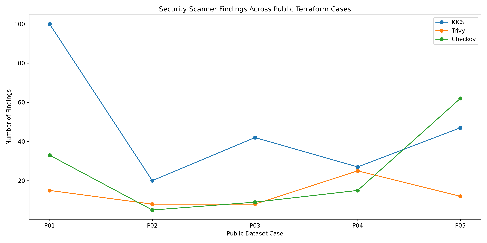

## Average findings

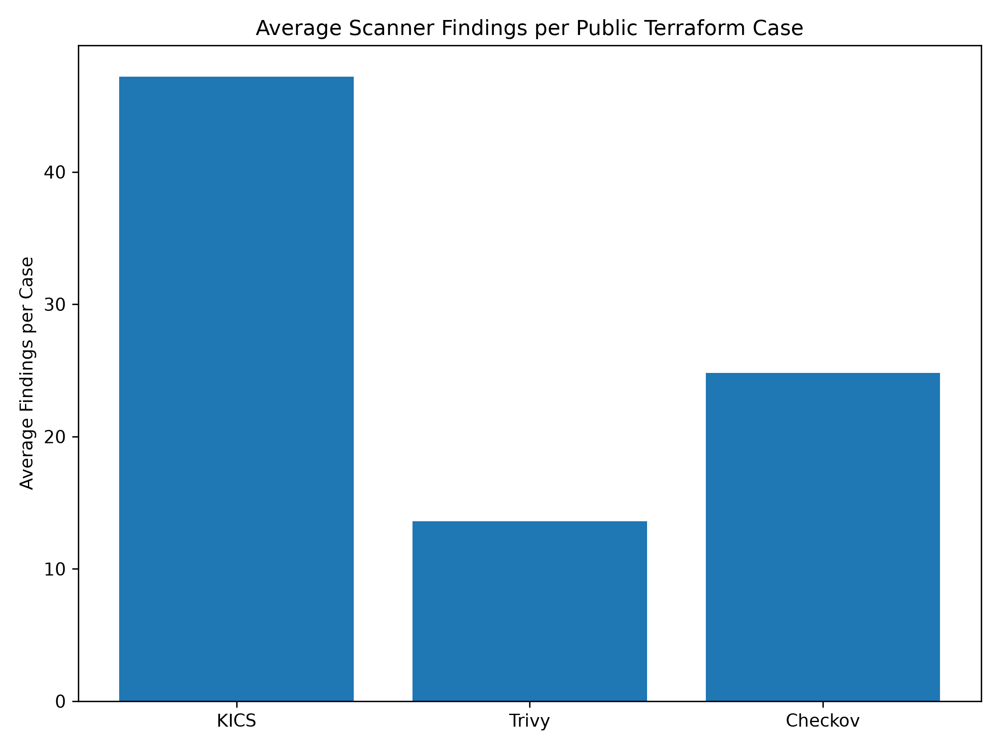

## Public scanner comparison

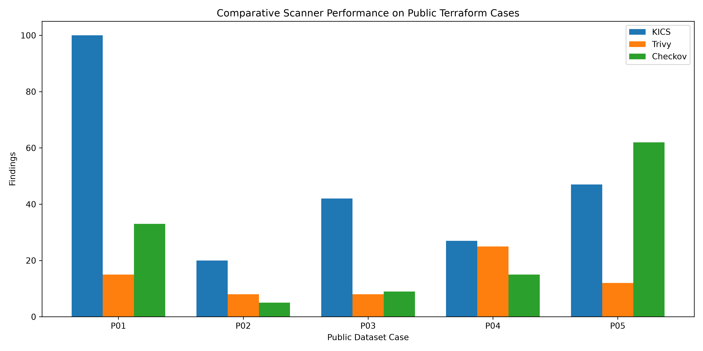

## Public scanner findings

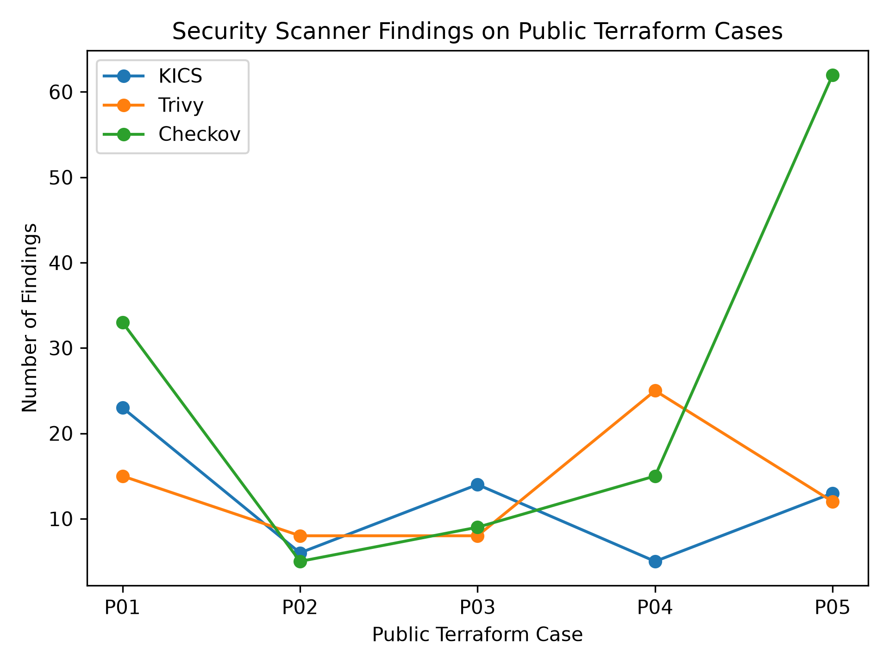

## Public scanner totals

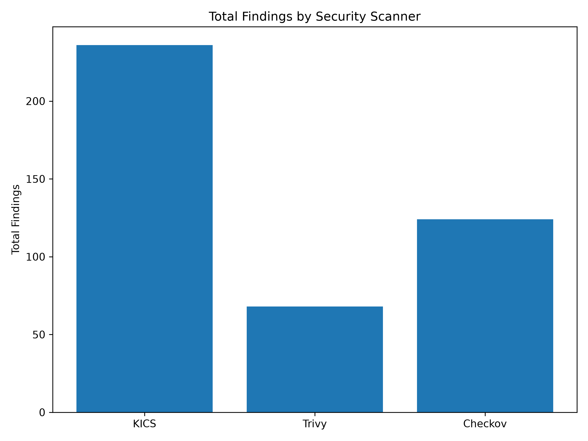

## Public ground-truth comparison

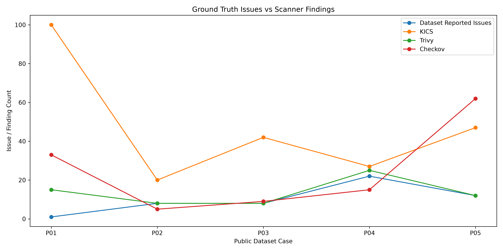

---

# 7. Detection matrix

The controlled experiment uses a case-level matrix:

```csv
case_id,corpus,target_vulnerability,ground_truth,KICS,Trivy,Checkov
S01,synthetic,public_s3_access,1,1,1,1
S02,synthetic,unrestricted_ssh_security_group,1,1,1,1
S03,synthetic,excessive_iam_privileges,1,1,0,1
...
B01,baseline,secure_s3_public_access,0,0,0,0
...
```

The authoritative generated matrix is:

```text
experiment/generated/detection_matrix.csv
```

---

# 8. Reproducibility

## Requirements

- Terraform
- Docker
- Python 3
- KICS
- Trivy
- Checkov

KICS can be executed through Docker, avoiding the need to install the KICS binary directly on the host.

## Run KICS

```bash
./scripts/run_kics.sh
```

## Run Trivy

```bash
./scripts/run_trivy.sh
```

## Run Checkov

```bash
./scripts/run_checkov.sh
```

Scanner outputs are written to `results/`.

---

# 9. Generate experiment results

After scanning, the analysis pipeline can regenerate the matrices, metrics and graphs:

```bash
python3 experiment/scripts/build_matrix.py
python3 experiment/scripts/calculate_metrics.py
python3 experiment/scripts/calculate_final_metrics.py
python3 experiment/scripts/complementarity.py
python3 experiment/scripts/generate_all_results.py
python3 experiment/scripts/plot_results.py
python3 experiment/scripts/plot_final_metrics.py
```

Generated outputs are stored under:

```text
experiment/generated/
experiment/results/
experiment/graphs/
```

## Public dataset analysis

```bash
python3 experiment/scripts/analyze_public.py
```

---

# 10. Combined security validation framework

```text
                    Terraform IaC
                         |
          +--------------+--------------+
          |              |              |
          v              v              v
       KICS           Trivy          Checkov
          |              |              |
          +--------------+--------------+
                         |
                         v
              Detection aggregation
                         |
                         v
               Combined result
```

The framework combines independent scanner outputs so that a target detected by any scanner is included in the combined result.

This is intended to exploit differences in scanner rule coverage.

---

# 11. Cross-resource IAM validation

The repository also contains a custom cross-resource IAM validation component:

```text
results/custom-iam.txt
```

The S08 case demonstrates a privilege-escalation relationship involving:

```text
iam:PassRole
+
ec2:RunInstances
```

This illustrates why cross-resource reasoning can complement conventional single-resource scanner rules.

---

# 12. Key findings

The controlled experiment indicates:

1. KICS and Trivy achieved high detection coverage but each missed one controlled target in the final matrix.
2. Checkov detected all ten controlled target vulnerabilities in the final result set.
3. The combined framework detected all ten controlled vulnerabilities.
4. The secure baseline corpus enables explicit evaluation of false positives.
5. The scanners have overlapping but non-identical rule coverage.
6. The public projects contain substantially more heterogeneous findings than the small controlled corpus.
7. Cross-resource IAM relationships can require additional analysis beyond isolated rule matching.
8. Multi-scanner aggregation is therefore a practical strategy for increasing detection coverage.

---

# 13. Limitations

- The controlled corpus contains only ten vulnerable and ten secure cases.
- The public validation corpus contains five projects.
- Scanner results depend on tool versions and rule databases.
- Public issue metadata does not necessarily correspond one-to-one with scanner findings.
- Case-level binary detection does not capture the severity or quality of every finding.
- The combined framework currently uses logical aggregation rather than a learned model.
- Static IaC analysis does not replace runtime cloud security validation.

The results should therefore be interpreted as an experimental evaluation of static Terraform IaC security detection.

---

# 14. Future work

Potential extensions include:

- Expanding the public Terraform corpus.
- Adding additional IaC security scanners.
- Adding cloud-provider-specific cases.
- Improving cross-resource analysis.
- Measuring execution time and resource consumption.
- Evaluating scanner-version sensitivity.
- Mapping equivalent findings across scanners.
- Adding severity-weighted metrics.
- Evaluating larger benchmark datasets.
- Integrating the framework into CI/CD pipelines.

---

# 15. Repository hygiene

Terraform provider binaries are generated locally by `terraform init` and must not be committed.

The repository should ignore:

```text
.terraform/
*.tfstate
*.tfstate.*
```

These files are reproducible and are not required to reproduce the source Terraform configurations or static analysis experiments.

---

# 16. Conclusion

This repository provides a reproducible environment for evaluating Terraform IaC security scanners.

The controlled experiments show that KICS, Trivy and Checkov have overlapping but non-identical detection behaviour. The combined framework provides a practical mechanism for aggregating complementary scanner detections.

The public Terraform projects provide an additional external validation corpus and demonstrate the diversity of findings encountered in real-world Terraform configurations.

Overall, the project supports the research proposition that **multi-layer IaC security validation can provide broader detection coverage than relying on a single static analysis tool alone**.
