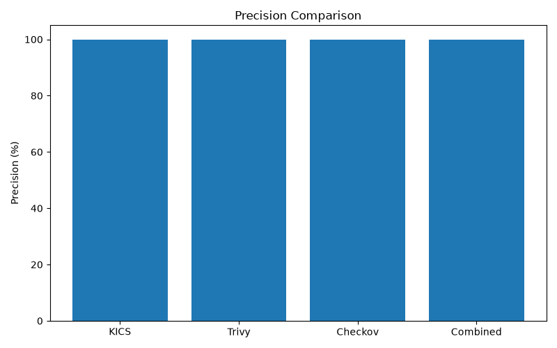
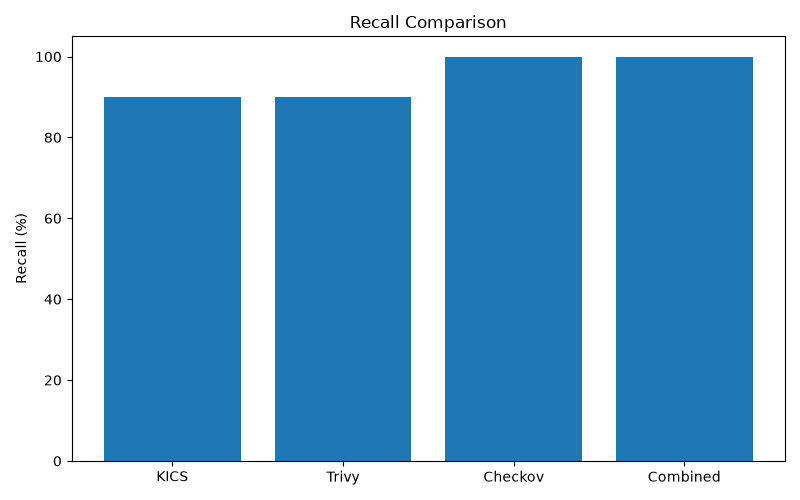
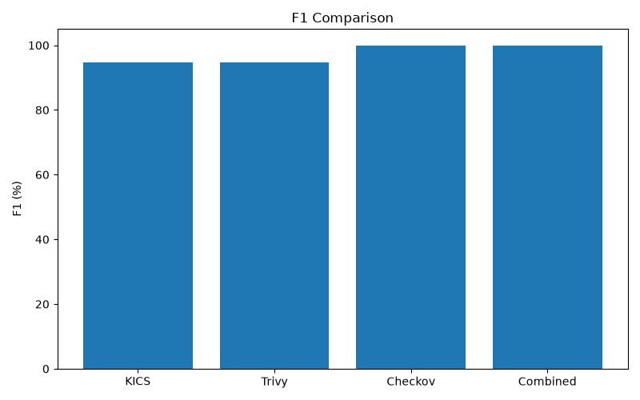
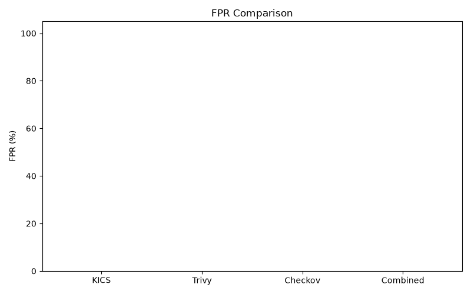
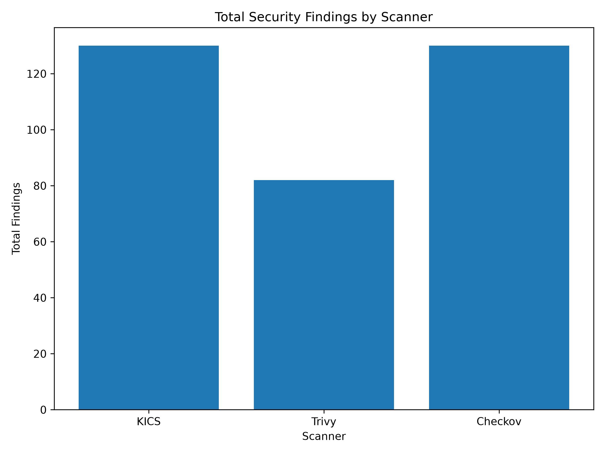
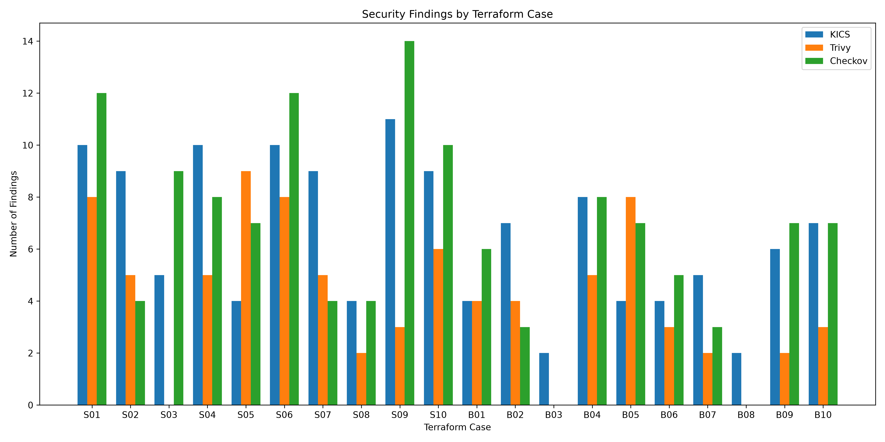

# Terraform Security Lab

A reproducible experimental framework for evaluating Terraform Infrastructure-as-Code (IaC) security scanning using KICS, Trivy, Checkov, and a combined multi-scanner detection approach.

## Research objective

The project evaluates whether combining multiple IaC security scanners improves vulnerability detection compared with relying on a single scanner.

The experiment measures:

- True positives (TP)
- True negatives (TN)
- False positives (FP)
- False negatives (FN)
- Accuracy
- Precision
- Recall
- F1-score
- False-positive rate (FPR)
- Scanner complementarity

Three corpora are evaluated:

1. **Synthetic vulnerable Terraform cases:** S01-S10
2. **Secure baseline cases:** B01-B10
3. **Public Terraform projects:** P01-P05

---

## Repository structure

```text
.
├── dataset/
│   ├── synthetic/          # Controlled vulnerable Terraform cases
│   ├── secure/             # Secure baseline cases
│   ├── public/             # Public Terraform projects
│   ├── dataset.csv
│   └── ground_truth.csv
├── experiment/
│   ├── generated/          # Generated matrices, metrics and summaries
│   ├── graphs/             # Experiment figures
│   ├── public_dataset/     # Public-dataset analysis
│   ├── results/            # Experiment result tables
│   ├── scripts/            # Analysis and plotting scripts
│   └── README.md
├── results/
│   ├── kics/
│   ├── trivy/
│   ├── checkov/
│   ├── public/
│   └── custom-iam.txt
├── scripts/
│   ├── run_kics.sh
│   ├── run_trivy.sh
│   └── run_checkov.sh
├── comparison_report.py
└── README.md
```

Terraform-generated directories such as `.terraform/` and Terraform state files are intentionally excluded from version control.

---

# 1. Experimental dataset

## Synthetic corpus

Ten intentionally vulnerable Terraform configurations represent common IaC security weaknesses.

| Case | Target vulnerability |
|---|---|
| S01 | Public S3 access |
| S02 | Unrestricted SSH security group |
| S03 | Excessive IAM privileges |
| S04 | Unsecured RDS |
| S05 | Unencrypted S3 |
| S06 | Public S3 write access |
| S07 | Unrestricted RDP security group |
| S08 | Dangerous IAM PassRole |
| S09 | Excessive Lambda IAM privileges |
| S10 | Public/unprotected RDS |

## Secure baseline

Ten secure configurations, B01-B10, are used to evaluate false-positive behaviour.

## Public dataset

Five public Terraform projects, P01-P05, were selected from the `galcan/terraform_sec` dataset. The included `source.txt` files preserve the source dataset/project metadata used during the experiment.

---

# 2. Security scanners

### KICS

KICS scans Infrastructure-as-Code configurations for security issues.

Raw results:

```text
results/kics/
results/public/kics/
```

### Trivy

Trivy is used for Terraform misconfiguration scanning.

Raw results:

```text
results/trivy/
results/public/trivy/
```

### Checkov

Checkov provides policy-based IaC security analysis.

Raw results:

```text
results/checkov/
results/public/checkov/
```

---

# 3. Experimental methodology

Each synthetic and baseline case is independently scanned by all three tools.

The resulting case-level detection matrix uses:

```text
1 = target vulnerability detected
0 = target vulnerability not detected
```

The controlled ground truth identifies whether the target vulnerability is intentionally present.

The combined framework uses the union of scanner detections:

```text
Combined = KICS OR Trivy OR Checkov
```

This evaluates whether complementary scanners increase detection coverage.

The public projects are analysed separately because their source metadata does not provide the same controlled, one-target-per-case ground truth as the synthetic corpus.

---

# 4. Final controlled-corpus results

The controlled detection matrix is stored in:

```text
experiment/generated/detection_matrix.csv
```

Final metrics are stored in:

```text
experiment/generated/tool_metrics.csv
experiment/generated/combined_metrics.txt
experiment/generated/final_experiment_summary.txt
```

### Final metrics

| Tool | TP | TN | FP | FN | Accuracy | Precision | Recall | F1 | FPR |
|---|---:|---:|---:|---:|---:|---:|---:|---:|---:|
| KICS | 9 | 10 | 0 | 1 | 94.74% | 100.00% | 90.00% | 94.74% | 0.00% |
| Trivy | 9 | 10 | 0 | 1 | 94.74% | 100.00% | 90.00% | 94.74% | 0.00% |
| Checkov | 10 | 10 | 0 | 0 | 100.00% | 100.00% | 100.00% | 100.00% | 0.00% |
| Combined | 10 | 10 | 0 | 0 | 100.00% | 100.00% | 100.00% | 100.00% | 0.00% |

> The generated result files are the source of truth if the experiment is rerun.

---

# 5. Final experiment graphs

All figures below are existing experiment outputs under:

```text
experiment/graphs/
```

## Overall performance


## Accuracy


## Precision



## Recall



## F1-score



## False-positive rate



## Detection comparison


## Scanner findings



## Findings by case



## Vulnerable versus baseline


## Scanner complementarity


## Unique detection contribution


---

# 6. Public dataset validation

The public validation corpus contains:

```text
P01
P02
P03
P04
P05
```

Raw scanner results are stored under:

```text
results/public/
```

Processed outputs are stored under:

```text
experiment/generated/public_dataset_results.csv
experiment/generated/public_findings.csv
experiment/generated/public_validation.csv
experiment/generated/public/
```

The five projects contain real Terraform configurations and provide an external validation set. They are intentionally kept separate from the controlled TP/TN/FP/FN evaluation because their externally reported issue counts do not necessarily map one-to-one to individual scanner findings.

## Public findings by case


## Average findings


## Public scanner comparison


## Public scanner findings


## Public scanner totals


## Public ground-truth comparison


---

# 7. Detection matrix

The controlled experiment uses a case-level matrix:

```csv
case_id,corpus,target_vulnerability,ground_truth,KICS,Trivy,Checkov
S01,synthetic,public_s3_access,1,1,1,1
S02,synthetic,unrestricted_ssh_security_group,1,1,1,1
S03,synthetic,excessive_iam_privileges,1,1,0,1
...
B01,baseline,secure_s3_public_access,0,0,0,0
...
```

The authoritative generated matrix is:

```text
experiment/generated/detection_matrix.csv
```

---

# 8. Reproducibility

## Requirements

- Terraform
- Docker
- Python 3
- KICS
- Trivy
- Checkov

KICS can be executed through Docker, avoiding the need to install the KICS binary directly on the host.

## Run KICS

```bash
./scripts/run_kics.sh
```

## Run Trivy

```bash
./scripts/run_trivy.sh
```

## Run Checkov

```bash
./scripts/run_checkov.sh
```

Scanner outputs are written to `results/`.

---

# 9. Generate experiment results

After scanning, the analysis pipeline can regenerate the matrices, metrics and graphs:

```bash
python3 experiment/scripts/build_matrix.py
python3 experiment/scripts/calculate_metrics.py
python3 experiment/scripts/calculate_final_metrics.py
python3 experiment/scripts/complementarity.py
python3 experiment/scripts/generate_all_results.py
python3 experiment/scripts/plot_results.py
python3 experiment/scripts/plot_final_metrics.py
```

Generated outputs are stored under:

```text
experiment/generated/
experiment/results/
experiment/graphs/
```

## Public dataset analysis

```bash
python3 experiment/scripts/analyze_public.py
```

---

# 10. Combined security validation framework

```text
                    Terraform IaC
                         |
          +--------------+--------------+
          |              |              |
          v              v              v
       KICS           Trivy          Checkov
          |              |              |
          +--------------+--------------+
                         |
                         v
              Detection aggregation
                         |
                         v
               Combined result
```

The framework combines independent scanner outputs so that a target detected by any scanner is included in the combined result.

This is intended to exploit differences in scanner rule coverage.

---

# 11. Cross-resource IAM validation

The repository also contains a custom cross-resource IAM validation component:

```text
results/custom-iam.txt
```

The S08 case demonstrates a privilege-escalation relationship involving:

```text
iam:PassRole
+
ec2:RunInstances
```

This illustrates why cross-resource reasoning can complement conventional single-resource scanner rules.

---

# 12. Key findings

The controlled experiment indicates:

1. KICS and Trivy achieved high detection coverage but each missed one controlled target in the final matrix.
2. Checkov detected all ten controlled target vulnerabilities in the final result set.
3. The combined framework detected all ten controlled vulnerabilities.
4. The secure baseline corpus enables explicit evaluation of false positives.
5. The scanners have overlapping but non-identical rule coverage.
6. The public projects contain substantially more heterogeneous findings than the small controlled corpus.
7. Cross-resource IAM relationships can require additional analysis beyond isolated rule matching.
8. Multi-scanner aggregation is therefore a practical strategy for increasing detection coverage.

---

# 13. Limitations

- The controlled corpus contains only ten vulnerable and ten secure cases.
- The public validation corpus contains five projects.
- Scanner results depend on tool versions and rule databases.
- Public issue metadata does not necessarily correspond one-to-one with scanner findings.
- Case-level binary detection does not capture the severity or quality of every finding.
- The combined framework currently uses logical aggregation rather than a learned model.
- Static IaC analysis does not replace runtime cloud security validation.

The results should therefore be interpreted as an experimental evaluation of static Terraform IaC security detection.

---

# 14. Future work

Potential extensions include:

- Expanding the public Terraform corpus.
- Adding additional IaC security scanners.
- Adding cloud-provider-specific cases.
- Improving cross-resource analysis.
- Measuring execution time and resource consumption.
- Evaluating scanner-version sensitivity.
- Mapping equivalent findings across scanners.
- Adding severity-weighted metrics.
- Evaluating larger benchmark datasets.
- Integrating the framework into CI/CD pipelines.

---

# 15. Repository hygiene

Terraform provider binaries are generated locally by `terraform init` and must not be committed.

The repository should ignore:

```text
.terraform/
*.tfstate
*.tfstate.*
```

These files are reproducible and are not required to reproduce the source Terraform configurations or static analysis experiments.

---

# 16. Conclusion

This repository provides a reproducible environment for evaluating Terraform IaC security scanners.

The controlled experiments show that KICS, Trivy and Checkov have overlapping but non-identical detection behaviour. The combined framework provides a practical mechanism for aggregating complementary scanner detections.

The public Terraform projects provide an additional external validation corpus and demonstrate the diversity of findings encountered in real-world Terraform configurations.

Overall, the project supports the research proposition that **multi-layer IaC security validation can provide broader detection coverage than relying on a single static analysis tool alone**.
