# Terraform Security Lab

A reproducible experimental framework for evaluating Terraform Infrastructure-as-Code (IaC) security scanning using KICS, Trivy, Checkov, and a combined multi-scanner detection approach.

## 1. Project Overview

This repository supports a research-oriented comparison of static IaC security scanners on Terraform workloads. The project evaluates how scanner rule coverage, detection patterns, and multi-tool aggregation affect the identification of unsafe Terraform configurations in both controlled test cases and real-world repositories.

The lab is designed to be fully reproducible and includes:

- Controlled synthetic and secure Terraform corpora
- Independent real-world Terraform repositories
- Scanner result capture for KICS, Trivy, and Checkov
- Ground-truth evaluation for controlled benchmarks
- Raw result aggregation and metric generation
- Graphs for performance and complementarity analysis

---

## 2. Research Objectives

The project evaluates whether combining multiple IaC security scanners improves vulnerability detection compared with relying on a single scanner.

The experiment measures:

- True positives (TP)
- True negatives (TN)
- False positives (FP)
- False negatives (FN)
- Accuracy
- Precision
- Recall
- F1-score
- False-positive rate (FPR)
- Scanner complementarity
- Raw finding volume and severity distribution

The overall research question is straightforward:

> Can a multi-scanner strategy expand detection coverage beyond the rule set of any single static scanner while remaining practically reproducible in real Terraform repositories?

Three corpora are evaluated:

1. Synthetic vulnerable Terraform cases: S01-S10
2. Secure baseline cases: B01-B10
3. Independent real-world Terraform repositories from the IaCSecBench benchmark

---

## 3. Security Scanners

### KICS

KICS scans Infrastructure-as-Code configurations for security issues and is used as one of the primary multi-tool detection sources.

Raw results are stored under:

```text
results/kics/
results/independent/kics/
```

### Trivy

Trivy is used for Terraform misconfiguration scanning and produces JSON results for policy and misconfiguration analysis.

Raw results are stored under:

```text
results/trivy/
results/independent/trivy/
```

### Checkov

Checkov provides policy-based IaC security analysis and is used to assess scanner agreement and independent coverage.

Raw results are stored under:

```text
results/checkov/
results/independent/checkov/
```

These scanner outputs are combined in the analysis pipeline to explore overlap, complementarity, and detection coverage.

Exact scanner versions (confirmed from version fields embedded in the
committed result JSON, not just what happens to be installed) are recorded
in [`VERSIONS.md`](VERSIONS.md). Static-analysis rule sets change between
releases, so the case-level outcomes in this repository are tied to those
specific versions and are not guaranteed to reproduce identically against
newer scanner releases.

---

## 4. Dataset

### Controlled Dataset

The controlled corpus contains intentionally vulnerable and secure Terraform cases, enabling a binary classification evaluation against known ground truth.

#### Synthetic vulnerable cases

Ten intentionally vulnerable Terraform configurations represent common IaC security weaknesses.

| Case | Target vulnerability |
|---|---|
| S01 | Public S3 access |
| S02 | Unrestricted SSH security group |
| S03 | Excessive IAM privileges |
| S04 | Unsecured RDS |
| S05 | Unencrypted S3 |
| S06 | Public S3 write access |
| S07 | Unrestricted RDP security group |
| S08 | Dangerous IAM PassRole |
| S09 | Excessive Lambda IAM privileges |
| S10 | Public/unprotected RDS |

#### Secure baseline cases

Ten secure configurations, B01-B10, are used to evaluate false-positive behavior.

#### Public validation corpus

Five public Terraform projects, P01-P05, are included as an external validation set. They are analyzed separately from the controlled benchmark because their source metadata does not follow the same one-target-per-case ground-truth structure.

### Independent Real-World Dataset

The real-world benchmark consists of 25 Terraform repositories from the IaCSecBench independent corpus.

> **Reproducibility note:** the 25 repositories' Terraform source is not
> vendored in this repository - only the scanner output JSON under
> `results/independent/` is committed. `dataset/independent/MANIFEST.csv`
> lists each repository's verified GitHub clone URL, and
> `scripts/fetch_independent_dataset.sh` re-clones all 25 into
> `dataset/independent/iacsecbench/` so that
> `experiment/scripts/analyze_iacsecbench.py` can recompute the Terraform
> file/LOC/resource/module counts below. Without that source present, the
> script now refuses to run rather than silently overwriting these numbers
> with zeros.

| Metric | Result |
|---|---:|
| Repositories | 25 |
| Terraform files | 285 |
| Terraform LOC | 15,226 |
| Terraform resources | 728 |
| Terraform modules | 41 |
| KICS findings | 1,094 |
| Trivy findings | 185 |
| Checkov findings | 286 |
| Combined raw findings | 1,565 |
| Mean findings / 1,000 LOC | 111.495 |
| Median findings / 1,000 LOC | 80.838 |
| Mean findings / resource | 2.626 |
| Median findings / resource | 2.320 |

#### Scanner coverage

| Scanner | Findings | Share | Repositories |
|---|---:|---:|---:|
| KICS | 1,094 | 69.90% | 25 |
| Checkov | 286 | 18.27% | 20 |
| Trivy | 185 | 11.82% | 13 |

The generated analysis summaries are under:

```text
experiment/generated/independent/
```

Currently, the independent dataset provides CSV summaries rather than generated PNG plots. No additional independent graph files were created for the README beyond the existing controlled experiment graphs listed below.

---

## 5. Experimental Methodology

Each synthetic and baseline case is independently scanned by all three tools.

The resulting case-level detection matrix uses:

```text
1 = target vulnerability detected
0 = target vulnerability not detected
```

The controlled ground truth identifies whether the target vulnerability is intentionally present.

The combined framework uses the union of scanner detections:

```text
Combined = KICS OR Trivy OR Checkov
```

This evaluates whether complementary scanners increase detection coverage.

For the independent real-world corpus, the analysis is based on repository-level raw findings and aggregate volume rather than case-by-case ground-truth labeling. The purpose is to characterize scanner output breadth and overlap in realistic Terraform repositories.

The repository also includes a custom cross-resource IAM validation component:

```text
results/custom-iam.txt
```

This demonstrates how cross-resource relationships such as `iam:PassRole` combined with `ec2:RunInstances` can require analysis beyond single-resource rule checking.

---

## 6. Controlled Benchmark Results

The controlled detection matrix (target-vulnerability-specific, hand-verified
against each scanner's raw output) is stored in:

```text
experiment/results/detection_matrix.csv
```

Final metrics computed from that matrix are stored in:

```text
experiment/results/tool_metrics.csv
experiment/results/metrics.txt
```

`experiment/generated/final_experiment_summary.txt` describes the dataset
composition only; it does not contain metric values.

### Final controlled metrics

| Tool | TP | TN | FP | FN | Accuracy | Precision | Recall | F1 | FPR |
|---|---:|---:|---:|---:|---:|---:|---:|---:|---:|
| KICS | 9 | 10 | 0 | 1 | 94.74% | 100.00% | 90.00% | 94.74% | 0.00% |
| Trivy | 9 | 10 | 0 | 1 | 94.74% | 100.00% | 90.00% | 94.74% | 0.00% |
| Checkov | 10 | 10 | 0 | 0 | 100.00% | 100.00% | 100.00% | 100.00% | 0.00% |
| Combined | 10 | 10 | 0 | 0 | 100.00% | 100.00% | 100.00% | 100.00% | 0.00% |

> The generated result files are the source of truth if the experiment is rerun.

### Statistical rigor

With only 20 controlled cases, a single flipped case moves accuracy by five
points, so the table above is reported with a bootstrap confidence interval
and a paired significance test rather than as a bare point estimate. Both
are computed by `experiment/scripts/statistical_analysis.py` and written to
`experiment/generated/statistical_analysis.txt`.

| Tool | Accuracy | 95% bootstrap CI |
|---|---:|---|
| KICS | 95.00% | [85.00%, 100.00%] |
| Trivy | 95.00% | [85.00%, 100.00%] |
| Checkov | 100.00% | [100.00%, 100.00%] |
| Combined | 100.00% | [100.00%, 100.00%] |

Pairwise McNemar's exact tests between every tool pair are **not
significant** (p = 1.0 in all cases) because there are at most 1-2
discordant cases between any pair of tools at this sample size. This is an
honest limitation, not a null result to explain away: it means the ranking
in the table above describes this specific 20-case corpus and should not be
read as a population-level claim about scanner quality. A corpus of several
hundred independently-sourced cases would be needed before a significance
claim is defensible (see Limitations and Threats to Validity below).

### Raw finding presence (noise-inclusive sensitivity check)

The target-vulnerability matrix above asks "did the scanner flag *the
specific injected weakness*?" A different, stricter question is "did the
scanner produce *any* finding at all on this file?" - since scanners also
fire on unrelated issues (missing tags, naming conventions, missing
descriptions) even on otherwise-secure baseline files. Both questions
matter, so both are reported rather than only the more favorable one.

This sensitivity check is produced by `experiment/scripts/generate_all_results.py`
and written to:

```text
experiment/generated/raw_finding_matrix.csv
experiment/generated/raw_finding_tool_metrics.csv
experiment/generated/raw_finding_combined_metrics.txt
experiment/generated/raw_finding_summary.txt
```

Under this any-finding definition, KICS, Trivy and Checkov all produce
findings on most baseline files too (driven mostly by stylistic/metadata
rules unrelated to the injected vulnerability), which pulls precision down
to roughly 50-56% - a reminder that the 100% precision in the headline
table is specific to the target vulnerability being evaluated, not to the
tools' total output. Treat the two tables as answering different questions
about the same 20 files, not as contradicting each other.

### Generated experiment graphs

The following graphs are existing outputs under `experiment/graphs/` and are included in the repository:

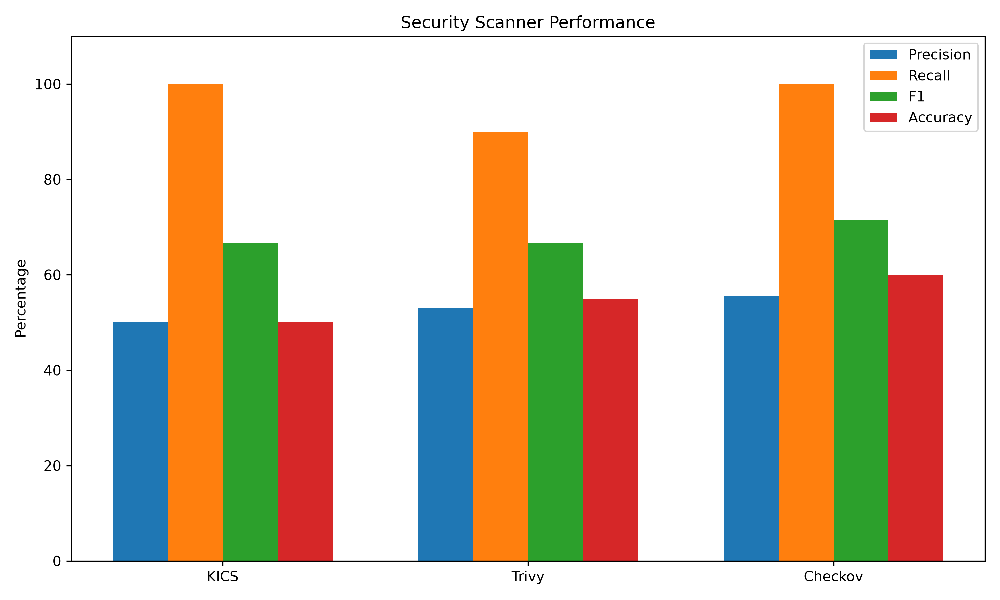

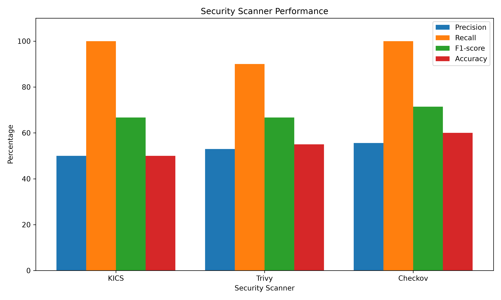

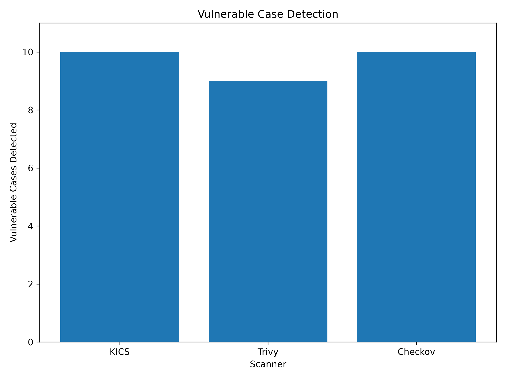

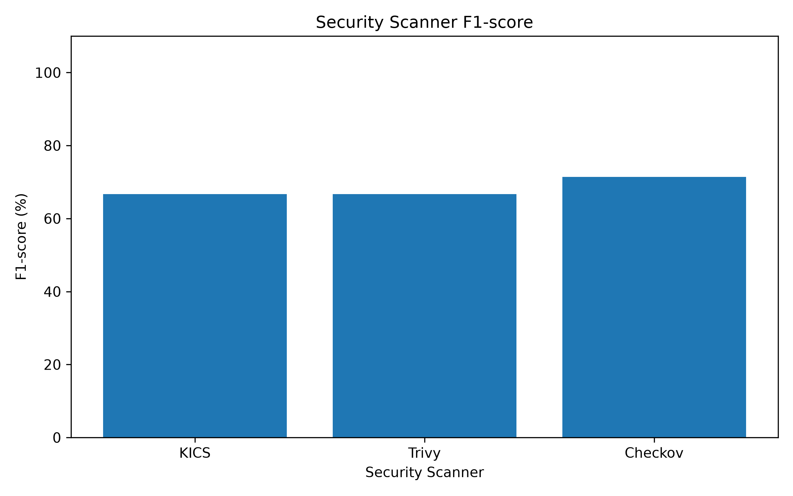

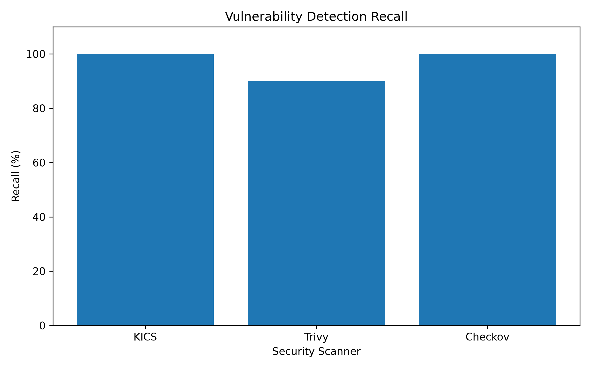


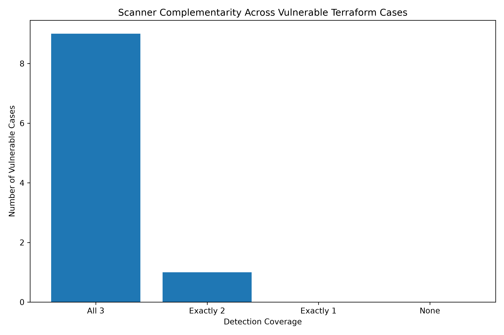

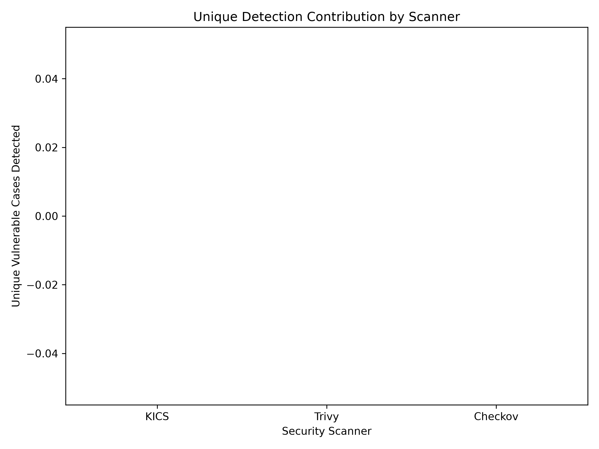

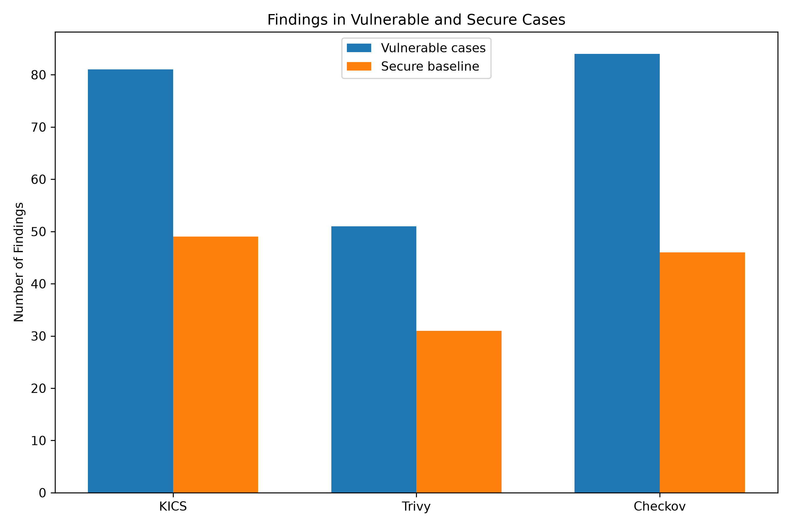

---

## 7. Real-World Dataset Results

The independent real-world dataset is located under:

```text
dataset/independent/iacsecbench/
```

and the corresponding analysis output is generated under:

```text
experiment/generated/independent/
```

### Summary of the independent real-world benchmark

| Metric | Result |
|---|---:|
| Repositories analysed | 25 |
| Terraform files | 285 |
| Terraform LOC | 15,226 |
| Terraform resources | 728 |
| Terraform modules | 41 |
| KICS findings | 1,094 |
| Trivy findings | 185 |
| Checkov findings | 286 |
| Combined raw findings | 1,565 |
| Mean findings / 1,000 LOC | 111.495 |
| Median findings / 1,000 LOC | 80.838 |
| Mean findings / resource | 2.626 |
| Median findings / resource | 2.320 |

### Scanner coverage by repository

| Scanner | Findings | Share | Repositories |
|---|---:|---:|---:|
| KICS | 1,094 | 69.90% | 25 |
| Checkov | 286 | 18.27% | 20 |
| Trivy | 185 | 11.82% | 13 |

### Independent dataset outputs

The current generated summaries include:

```text
experiment/generated/independent/dataset_summary.txt
experiment/generated/independent/scanner_summary.csv
experiment/generated/independent/repository_metrics.csv
experiment/generated/independent/severity_distribution.csv
experiment/generated/independent/finding_categories.csv
experiment/generated/independent/resource_overlap.csv
experiment/generated/independent/resource_overlap_summary.txt
```

No independent PNG graphs are currently generated in `experiment/graphs/independent/`; the repository currently provides the CSV-based summary results for this benchmark instead.

### Resource-level scanner agreement

Rule IDs are not comparable across KICS, Trivy and Checkov (different
namespaces entirely), so finding-by-finding overlap can't be computed
directly. `experiment/scripts/overlap_analysis.py` instead checks, per
repository, whether two scanners flagged *the same Terraform resource*
(`<resource_type>.<label>`, regardless of which specific rule fired), and
reports a Jaccard index per tool pair plus how many distinct resources were
flagged by 1, 2, or all 3 tools:

| Flagged by | Resources | Share |
|---|---:|---:|
| Exactly 1 tool | 489 | 87.01% |
| Exactly 2 tools | 40 | 7.12% |
| All 3 tools | 33 | 5.87% |

| Tool pair | Mean Jaccard index |
|---|---:|
| KICS vs Trivy | 0.036 |
| KICS vs Checkov | 0.067 |
| Trivy vs Checkov | 0.193 |

87% of flagged resources are caught by only one of the three scanners. This
is the clearest quantitative evidence in this repository for the
complementarity claim: the scanners are mostly attending to different parts
of each repository's resource graph, not re-flagging the same resources
under different rule IDs. Note this is resource-level agreement (coarser
than rule-level), since rule-level matching across incompatible rule-ID
namespaces isn't possible without a manually-curated cross-scanner rule
mapping (listed under Future Work).

---

## 8. Key Findings

The controlled experiment indicates:

1. KICS and Trivy achieved high detection coverage but each missed one controlled target in the final matrix.
2. Checkov detected all ten controlled target vulnerabilities in the final result set.
3. The combined framework detected all ten controlled vulnerabilities.
4. The secure baseline corpus enables explicit evaluation of false positives.
5. The scanners have overlapping but non-identical rule coverage.
6. The independent real-world corpus contains substantially higher raw finding volume than the synthetic benchmark.
7. KICS produced the largest share of raw findings in the independent dataset, followed by Checkov and Trivy.
8. Multi-scanner aggregation is therefore a practical strategy for increasing detection coverage and reducing blind spots.

---

## 9. Project Structure

```text
.
├── dataset/
│   ├── synthetic/                  # Controlled vulnerable Terraform cases
│   ├── secure/                     # Secure baseline cases
│   ├── public/                     # Public Terraform projects
│   ├── independent/
│   │   ├── iacsecbench/            # Independent real-world benchmark (source not vendored)
│   │   └── MANIFEST.csv            # Verified GitHub URLs to re-clone the 25 repos
│   └── ground_truth.csv            # Kept in sync with experiment/data/ground_truth.csv
├── experiment/
│   ├── generated/                  # Generated matrices, metrics and summaries
│   ├── graphs/                     # Experiment figures
│   ├── public_dataset/             # Public-dataset analysis
│   ├── results/                    # Experiment result tables (official controlled metrics)
│   ├── scripts/                    # Analysis and plotting scripts
│   └── README.md
├── results/
│   ├── kics/
│   ├── trivy/
│   ├── checkov/
│   ├── public/
│   ├── independent/
│   └── custom-iam.txt
├── scripts/
│   ├── run_kics.sh
│   ├── run_trivy.sh
│   ├── run_checkov.sh
│   ├── run_iacsecbench_scanners.sh
│   ├── fetch_independent_dataset.sh  # Re-clones the 25 independent repos
│   └── ...
├── comparison_report.py
├── VERSIONS.md                     # Exact KICS/Trivy/Checkov versions used
├── README.md
└── .gitignore
```

Terraform-generated directories such as `.terraform/` and Terraform state files are intentionally excluded from version control.

---

## 10. Installation

### Prerequisites

- Terraform
- Docker
- Python 3
- KICS
- Trivy
- Checkov

Install or ensure the required tools are available in your PATH before running the scanner workflow.

### Docker-based KICS execution

KICS is executed through Docker, avoiding the need to install the KICS binary directly on the host.

---

## 11. Running the Scanners

Run the individual scanner scripts from the repository root:

```bash
./scripts/run_kics.sh
./scripts/run_trivy.sh
./scripts/run_checkov.sh
```

For the independent benchmark dataset, run:

```bash
./scripts/run_iacsecbench_scanners.sh
```

Scanner outputs are written to `results/` and the independent corpus outputs are stored under `results/independent/iacsecbench/`.

---

## 12. Reproducing the Experiments

After scanning, the analysis pipeline can regenerate the matrices, metrics, and graphs:

```bash
python3 experiment/scripts/build_matrix.py
python3 experiment/scripts/calculate_metrics.py
python3 experiment/scripts/calculate_final_metrics.py
python3 experiment/scripts/complementarity.py
python3 experiment/scripts/statistical_analysis.py
python3 experiment/scripts/generate_all_results.py
python3 experiment/scripts/plot_results.py
python3 experiment/scripts/plot_final_metrics.py
python3 experiment/scripts/analyze_iacsecbench.py
python3 experiment/scripts/overlap_analysis.py
```

`analyze_iacsecbench.py` requires the 25 independent repositories to be
present locally first - run `./scripts/fetch_independent_dataset.sh` once
beforehand (see Section 4). `overlap_analysis.py` depends only on the
scanner output already committed under `results/independent/`, so it runs
without the source repos present.

The public and independent dataset analysis steps are also supported:

```bash
python3 experiment/scripts/analyze_public.py
```

Generated outputs are stored under:

```text
experiment/generated/
experiment/results/
experiment/graphs/
```

---

## 13. Limitations

- The controlled corpus contains only ten vulnerable and ten secure cases.
- The independent real-world corpus contains 25 repositories, which is useful but still limited.
- Scanner results depend on tool versions and rule databases.
- Public and independent issue metadata does not necessarily correspond one-to-one with scanner findings.
- Case-level binary detection does not capture the severity or quality of every finding.
- The combined framework currently uses logical aggregation rather than a learned model.
- Static IaC analysis does not replace cloud runtime validation.

The results should therefore be interpreted as an experimental evaluation of static Terraform IaC security detection.

---

## 13a. Threats to Validity

This section exists separately from Limitations because these are risks to
whether the *conclusions* hold, not just gaps in scope.

**Construct validity - how the controlled ground truth was built.** The
0/1 values in `experiment/scripts/build_matrix.py` for whether a scanner
detected each case's target vulnerability were determined by a human
reading that scanner's raw output and deciding whether it matched the
injected weakness - they are not independently re-derivable by a script
from the scan output alone. Because the same person who wrote the
vulnerable Terraform cases also did this labeling, there is a risk of
circularity: knowing which rule a scanner was expected to fire lowers the
chance of missing a true detection, and could bias the comparison in favor
of whichever tool's rule coverage was most familiar while writing the
cases. This is the single biggest risk to the "combined beats any single
scanner" claim, and it is disclosed here rather than left implicit. The
mitigation used in this repository is the independent real-world benchmark
(Section 7), which was not authored by hand and shows the same
complementarity pattern (87% of flagged resources caught by only one
scanner) via the overlap analysis - but that benchmark has no ground truth,
so it corroborates *complementarity*, not the controlled corpus's precision
and recall numbers specifically. A stronger mitigation for future work
would be sourcing controlled cases from an external vulnerability catalog
(e.g. CIS Benchmark control IDs or published CWE examples) chosen before
reviewing any scanner's rule set.

**Internal validity - small, paired sample.** At n=20 controlled cases,
McNemar's exact test (Section 6) finds no statistically significant
difference between any pair of tools. The accuracy table should be read as
descriptive of this corpus, not as an established ranking of scanner
quality.

**External validity - real-world benchmark has no ground truth.** The
25-repository independent benchmark (Section 7) reports raw finding volume
and resource-level overlap, not precision or recall, because none of the
findings in those repositories have been manually verified as true or
false positives. The complementarity result there is real and independently
sourced, but "which scanner is most accurate in practice" cannot be
answered from this benchmark as currently labeled.

**Conclusion validity - severity is not part of any metric.** A missed
public-S3-bucket finding and a missed missing-tag finding both count as one
false negative in the controlled matrix. The real-world severity
distribution is reported separately (Section 7) but is not folded into the
accuracy/F1 numbers, so "100% F1" does not mean "catches every critical
issue with equal weight to every low-severity one."

---

## 14. Research Contribution

This project contributes a practical, reproducible framework for evaluating Terraform IaC scanning across multiple dimensions:

- controlled benchmark evaluation with labelled ground truth
- real-world repository assessment using an independent benchmark
- complementarity analysis across KICS, Trivy, and Checkov
- raw finding aggregation, severity review, and coverage comparison
- transparent result generation that can be rerun and extended by future researchers

In practice, the repository supports the research proposition that multi-layer IaC security validation can provide broader detection coverage than a single scanner alone.

---

## 15. Future Work

Potential extensions include:

- Expanding the public and independent Terraform corpora
- Adding additional IaC security scanners
- Adding cloud-provider-specific cases
- Improving cross-resource analysis
- Measuring execution time and resource consumption
- Evaluating scanner-version sensitivity
- Mapping equivalent findings across scanners
- Adding severity-weighted metrics
- Evaluating larger benchmark datasets
- Integrating the framework into CI/CD pipelines

---

## 16. References

1. KICS: https://www.kics.io/
2. Trivy: https://trivy.dev/
3. Checkov: https://www.checkov.io/
4. HashiCorp Terraform: https://www.terraform.io/
5. Infrastructure-as-Code security research literature on static analysis and IaC misconfiguration detection

---

## Repository hygiene

Terraform provider binaries are generated locally by `terraform init` and should not be committed.

The repository should ignore:

```text
.terraform/
*.tfstate
*.tfstate.*
```

These files are reproducible and are not required to reproduce the source Terraform configurations or static analysis experiments.

---

## Conclusion

This repository provides a reproducible environment for evaluating Terraform IaC security scanners.

The controlled experiments show that KICS, Trivy, and Checkov have overlapping but non-identical detection behavior. The combined framework provides a practical mechanism for aggregating complementary scanner detections.

The independent real-world benchmark further demonstrates the diversity and volume of findings encountered in realistic Terraform repositories, with KICS contributing the largest raw finding share but all three tools providing complementary coverage.

Overall, the project supports the research proposition that multi-scanner IaC validation can improve coverage and reduce blind spots relative to single-tool analysis.

Processed outputs are stored under:

```text
experiment/generated/public_dataset_results.csv
experiment/generated/public_findings.csv
experiment/generated/public_validation.csv
experiment/generated/public/
```

The five projects contain real Terraform configurations and provide an external validation set. They are intentionally kept separate from the controlled TP/TN/FP/FN evaluation because their externally reported issue counts do not necessarily map one-to-one to individual scanner findings.

## Public findings by case

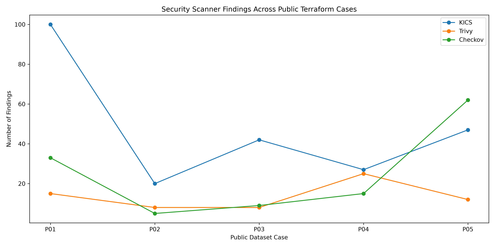

## Average findings

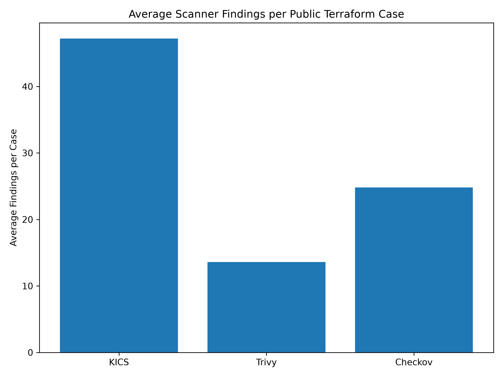

## Public scanner comparison

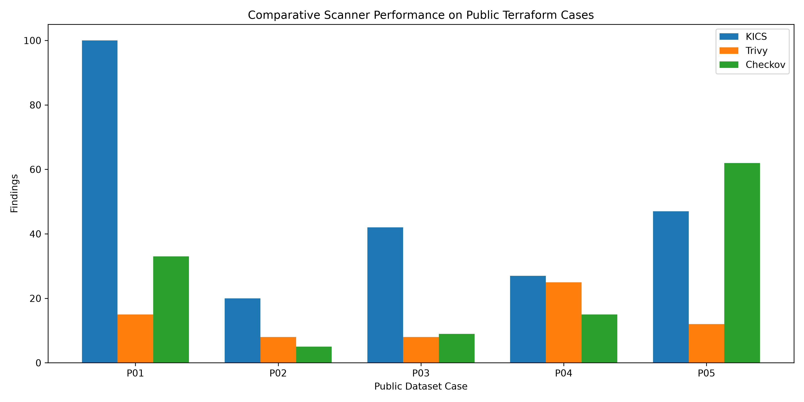

## Public scanner findings

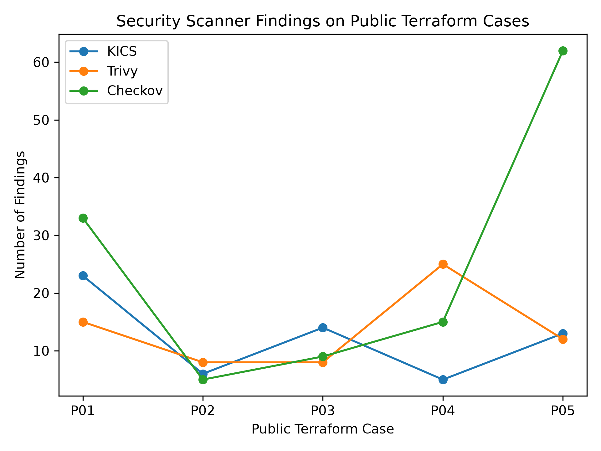

## Public scanner totals

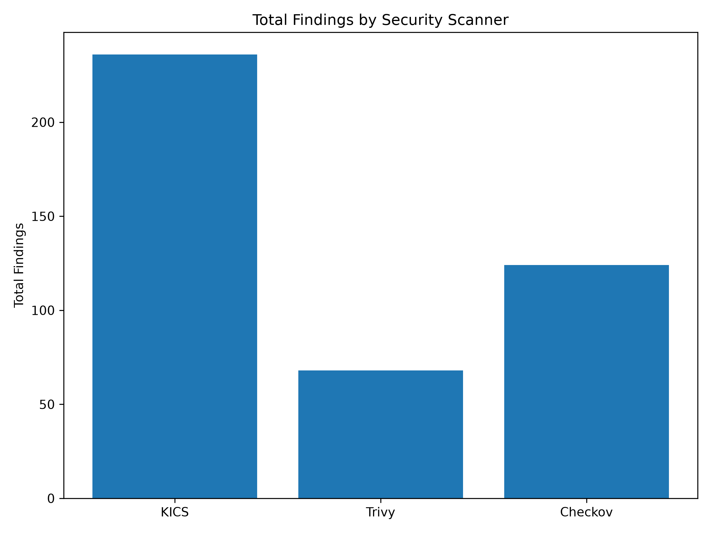

## Public ground-truth comparison

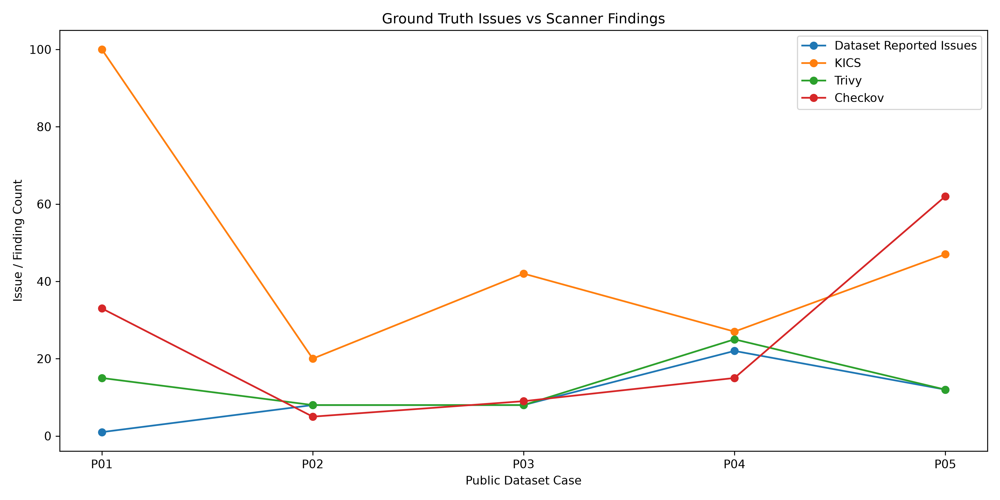

